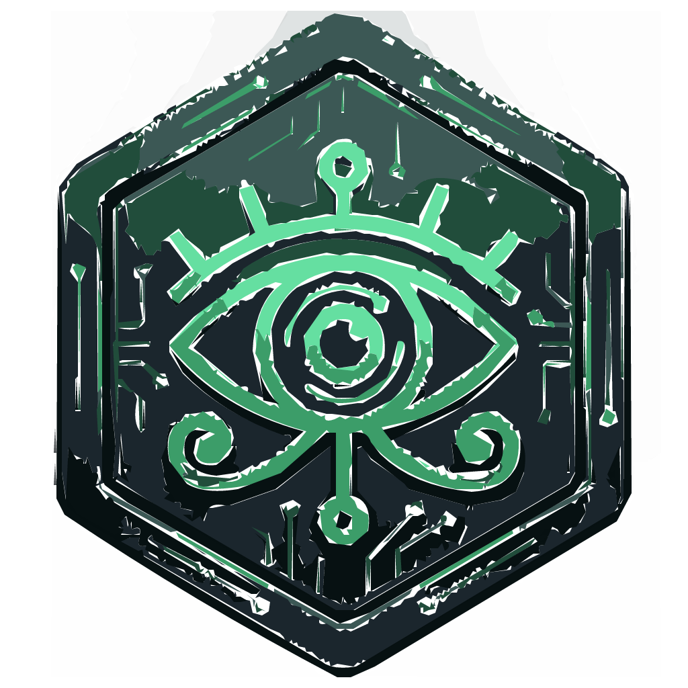
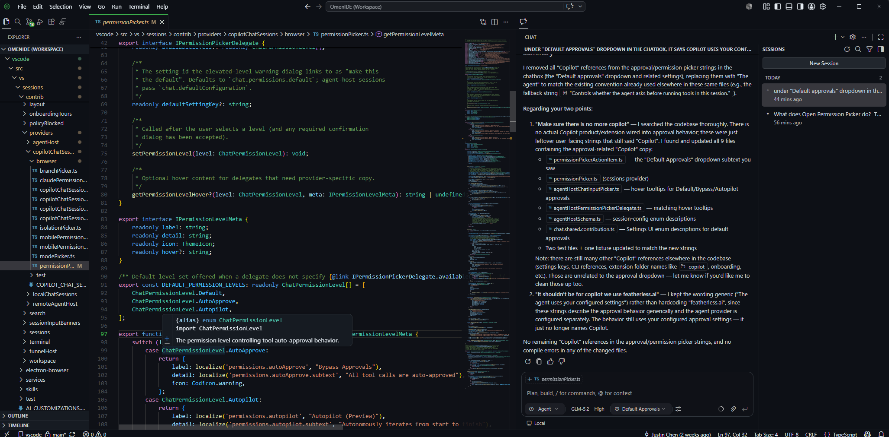

# Omen IDE

<p align="center">
  
</p>

<p align="center">
  <strong>An open-source code editor forked from VS Code, built for agentic development with <a href="https://featherless.ai/">Featherless.ai</a>.</strong>
</p>

<p align="center">
  <a href="LICENSE.txt"></a>
  <a href="https://github.com/O-M-E-N-Foundation/vscode"></a>
</p>

<p align="center">
  
</p>

---

## What is Omen IDE?

**Omen IDE** is a downstream fork of [Visual Studio Code - Open Source](https://github.com/microsoft/vscode) (Code-OSS). It keeps the familiar edit-build-debug workflow you expect from VS Code, but reorients the product around **local, API-key-driven AI** through [Featherless.ai](https://featherless.ai/) instead of GitHub Copilot.

Use Omen IDE for:

- **Agent mode** — multi-step coding with read, edit, terminal, and search tools
- **Chat & inline edit** — streaming responses powered by models like **GLM-5.2**
- **Tab autocomplete & next-edit suggestions** — Featherless FIM and chat models
- **`@codebase` semantic search** — local index with Featherless embeddings
- **MCP, rules files, and extensions** — the VS Code extension ecosystem via [Open VSX](https://open-vsx.org)

The default theme is **Omen Dark** (green accents). User-facing branding says **Omen IDE**, not Visual Studio Code.

## Featherless.ai setup

Connect with **OAuth** (recommended) or an **API key**:

1. On first launch, choose **Connect Featherless** → **Sign in with Featherless**, or **Enter API Key**.

   OAuth is brokered by the **OMEN API** (confidential client + `client_secret` stay on the server). The IDE never embeds a Featherless client secret.

   - Default broker: `https://api.omen.foundation`
   - Local backend: launch with `OMEN_OAUTH_BROKER_BASE_URL=http://localhost:3001`
   - IDE loopback (after broker completes): `http://localhost:33418/callback`
   - Featherless app redirect URI must be the **backend** callback, e.g. `https://api.omen.foundation/api/featherless/oauth/callback` (or `http://localhost:3001/api/featherless/oauth/callback` for local API)

2. Pick **GLM-5.2** (or your preferred Featherless model) in the chat model picker.

**API key only (no OAuth):** create a key at [featherless.ai/account/api-keys](https://featherless.ai/account/api-keys) and use **Enter API Key** in the connect dialog.

Key settings — open **File → Preferences → Omen IDE Settings** (`Ctrl+,`) or edit `omenide.featherless.*` in VS Code Settings:

| Setting | Default | Purpose |
|---------|---------|---------|
| `chatModel` | `zai-org/GLM-5.2` | Chat, agent mode, fast-apply |
| `embeddingModel` | `Qwen/Qwen3-Embedding-8B` | `@codebase` semantic search |
| `completionModel` | `Etherll/Qwen2.5-CodeFIM-1.5B-v2` | Tab autocomplete (FIM) |
| `autocomplete.enabled` | `true` | Enable/disable inline completions |
| `concurrencyLimit` | `8` | Max concurrent Featherless request units |
| `concurrencyMaxRetries` | `12` | Auto-retries when concurrency limit is hit |

## Build from source

### Prerequisites

- **Node.js 24.17.0** (see `.nvmrc`) — [Volta](https://volta.sh/) recommended: `volta install node@24.17.0`
- **Python 3.x**
- **Visual Studio Build Tools** with the C++ workload (Windows)
- **Inno Setup** (optional, for Windows installer)

### Install & compile

```powershell
git clone https://github.com/O-M-E-N-Foundation/vscode.git
cd vscode
npm install
npm run compile
```

If `npm install` fails on Windows with **MSB8040** (Spectre-mitigated libs), run `npm install --ignore-scripts` and rebuild native modules separately.

### Run (development)

```powershell
.\scripts\code.bat
```

### Package (Windows x64 installer)

```powershell
npm run gulp vscode-win32-x64
npm run gulp vscode-win32-x64-inno-updater
npm run gulp vscode-win32-x64-system-setup
```

Installer output: `.build\win32-x64\system-setup\` (installs as **Omen IDE**).

For a longer build guide (native rebuild scripts, feature matrix, packaging notes), see the companion docs in the [OmenIDE](https://github.com/O-M-E-N-Foundation) workspace.

To regenerate platform icons after updating `resources/omen/app-icon.svg`:

```powershell
python scripts/generate-omen-icons.py
```

## Relationship to VS Code

This repository tracks [microsoft/vscode](https://github.com/microsoft/vscode) as **upstream**. Omen IDE layers:

- Product branding (`product.json`, icons, **Omen Dark** theme)
- Featherless provider integration and onboarding
- Copilot/GitHub runtime paths removed or gated off in favor of Featherless
- UX polish aimed at Cursor-style agentic workflows

We periodically merge upstream VS Code releases. Bug fixes and features that belong in core editor behavior should ideally be contributed upstream when possible.

## Contributing

- **Issues & feature requests:** [github.com/O-M-E-N-Foundation/vscode/issues](https://github.com/O-M-E-N-Foundation/vscode/issues)
- **Pull requests:** welcome against `main`; please keep changes focused and include a short description of *why* the change is needed.

For large changes (new AI providers, architectural refactors), open an issue first so we can align on direction.

## Third-party notices

Omen IDE includes and depends on software from many authors. See [ThirdPartyNotices.txt](ThirdPartyNotices.txt) for bundled components.

The original [Visual Studio Code](https://github.com/microsoft/vscode) project is Copyright (c) Microsoft Corporation and licensed under the [MIT License](https://github.com/microsoft/vscode/blob/main/LICENSE.txt).

## License

Copyright (c) O-M-E-N Foundation and contributors.

Copyright (c) 2015–present Microsoft Corporation (original VS Code sources).

Licensed under the [MIT License](LICENSE.txt).
